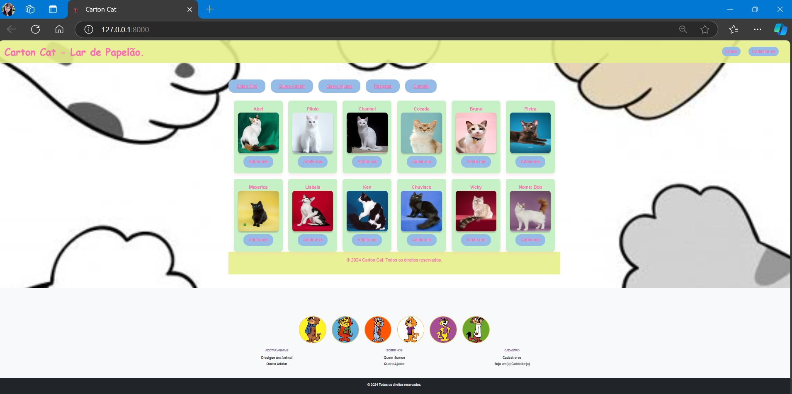
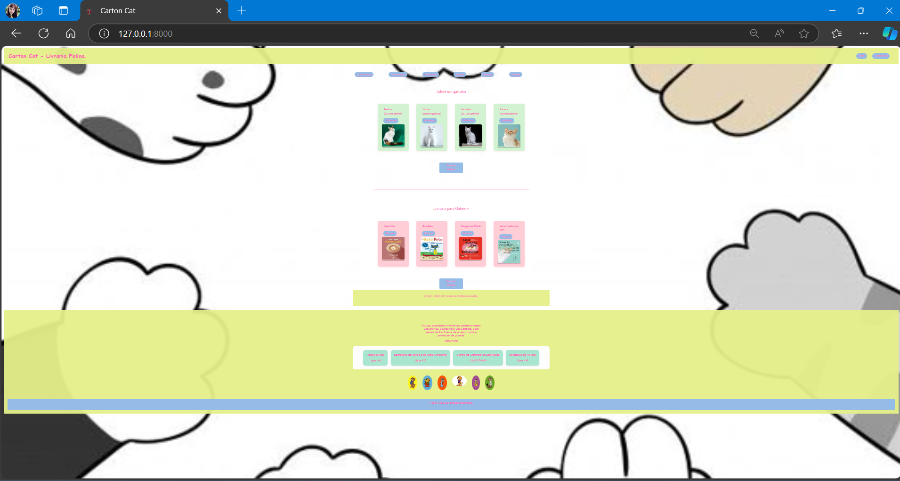

# 🐾 **Carton Cat - Lar de Papelão**  
**Lar e Livraria Felina - Primeiro Protótipo**

Bem-vindo ao **Carton Cat**! Este é um projeto desenvolvido durante o **Bootcamp Womakerscode**, utilizando **Python/Django** para criar uma plataforma dedicada aos amantes de gatos. Aqui, você pode adotar um novo amigo ou explorar nossa seção literária cheia de personagens felinos.  

---

## **✨ Protótipos da Interface**
|  |  |  |
|:-----------------------------------------------------------:|:-----------------------------------------------------------:|:-----------------------------------------------------------:|
| **Primeiro Protótipo**                                      | **Segundo Protótipo**                                       | **Terceiro Protótipo**                                      |

---

## **🚀 Funcionalidades**
- 🌟 **Seção de adoção**: Encontre o seu novo amigo felino.  
- 📚 **Seção literária**: Explore livros e mangás com personagens gatos.  
- 🐾 **Design responsivo**: Interface amigável e acessível para todos os dispositivos.  

---

## **🛠️ Como executar o projeto**
Siga as etapas abaixo para rodar o projeto localmente usando **Poetry**:  

### **1. Clone o repositório**
```bash
git clone https://github.com/suarepo/carton-cat.git
cd carton-cat
```

### **2. Instale o Poetry**  
Caso ainda não tenha o Poetry instalado, siga as instruções oficiais:  
[Instalação do Poetry](https://python-poetry.org/docs/#installation)  

### **3. Configure o ambiente**
Ative o ambiente virtual gerenciado pelo Poetry e instale as dependências:  
```bash
poetry install
```

### **4. Ative o ambiente virtual**
```bash
poetry shell
```

### **5. Configure o banco de dados**
Aplique as migrações para configurar o banco de dados:  
```bash
python manage.py migrate
```

### **6. Inicie o servidor**
```bash
python manage.py runserver
```

### **7. Acesse no navegador**  
Abra o navegador e acesse:  
```
http://127.0.0.1:8000
```

---

## **📁 Estrutura do Projeto**
```plaintext
carton-cat/
├── projeto/
│   ├── static/
│   │   └── images/
│   ├── templates/
│   └── settings.py
├── manage.py
├── pyproject.toml
├── poetry.lock
└── README.md
```

---

## **💡 Tecnologias Utilizadas**
- **Gerenciamento de Dependências**: [Poetry](https://python-poetry.org/)  
- **Backend**: Python 3.10, Django 4.x  
- **Frontend**: HTML5, CSS3, JavaScript  
- **Banco de Dados**: SQLite  

---

## **📜 Licença**
Este projeto está licenciado sob a **MIT License**.  

---

Divirta explorando o **Carton Cat - Lar de Papelão!** 🐱  
